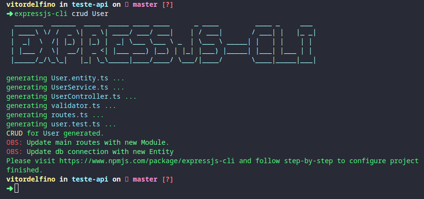
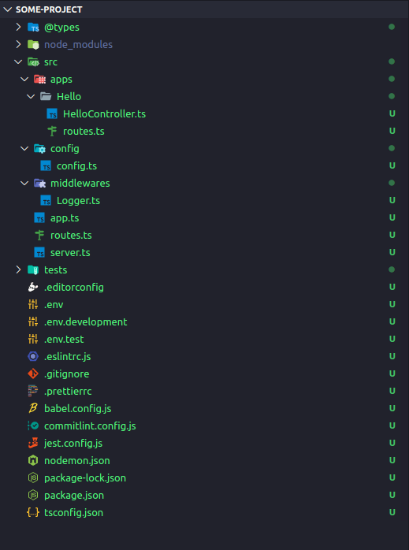

[](http://commitizen.github.io/cz-cli/)


# ExpressJs CLI (Project in progress)

A CLI to create a nodejs project pre configured

## Techs

- Express
- Typescript
- Jest
- ESLint
- Babel
- Commitizen
- Husky

## How to use

> Install package globally

```bash
yarn add --global expressjs-cli
or
npm i -g expressjs-cli
```

> Run command to create a project

```bash
expressjs-cli start <project name>
```

## Configuring after generate project

You can rename all folders, files, contents that obtain "Replace" text;

- src/apps/Replace (all files)
- src/config/db/standart.connection.ts

Update env files with DATABASE_URL, example below.

`.env | .env.development | .env.test`

```auto
  DATABASE_URL=mongodb+srv://<username>:<password>@<host>/<database>?retryWrites=true&w=majority
```

## Generate new CRUD

> Run command in root path (near package.json)

```bash
expressjs-cli crud <Model | Entity>
```



Command will generate a new module in `src/apps` folder with:

- Route
- Validator
- Controller
- Service
- Crud tests

After run command updates some files;

- `src/routes.ts`: import new routes from module and configure the path
- `src/config/db/standart.connection.ts`: add new Entity on Typeorm connection

---

## Informations

Some infos about created project.

### Structure



### How to throw Errors


### How to use logger


### Use Yup or class-validator to validate models

- Always import "express-async-errors" when use middlewares in your routes


---

## Run tests

```bash
yarn test
or
npm run test
```
